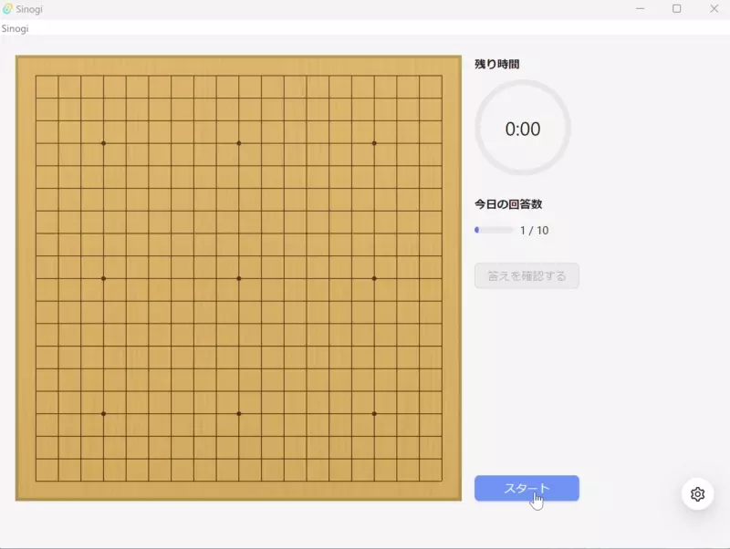

Sinogi
==

自分で用意した詰碁・手筋問題を使って囲碁の練習ができるアプリです。



## Users Guide

ユーザーズガイドは[こちら](users-guide/UsersGuide.md)にあります。

## Build & Test

下記のものが必要です。

- Rust 1.61
- Node.js 16

### Frontend

フロントエンド開発用のサーバーは

```shell
yarn
yarn dev
```

で起動できます。

### Frontend Tests

テストは

- React hooks
- Helpers

について記載しており、

```shell
yarn test --coverage
```

で実行できます。

### Backend

バックエンド部分も含めたアプリは

```shell
cargo tauri dev
```

で起動できます。

## Licence

このアプリはMITでライセンスしています。
