ユーザーズガイド
==

## 詰碁・手筋問題の作り方

詰碁・手筋問題はSGF形式のファイルを用意する必要があります。

作成には[Sabaki](https://github.com/SabakiHQ/Sabaki)を使うのが便利です。

### 問題情報の入力

`メニュー ＞ ファイル ＞ 棋譜情報` を選択し、下に現れるパネルに問題の情報を入力します。

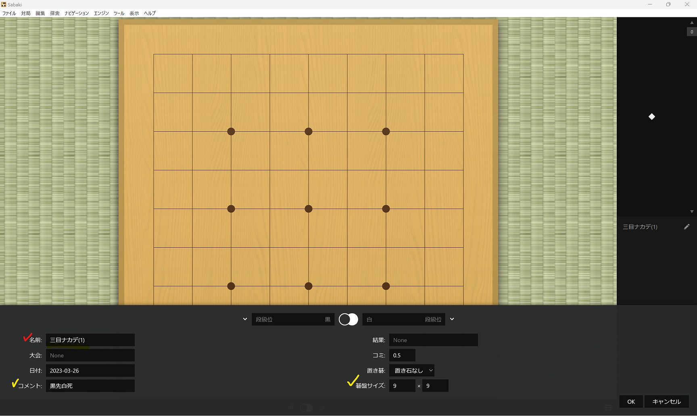

- 名前は入力必須です。
- コメントを入力すると詰碁問題の表示時に補助情報として表示できます。
- 好きな碁盤サイズを選べます。
- その他の項目は使いません。

入力し終わったら[OK]を押してください。

### 初期配置の入力

`メニュー ＞ 編集 ＞ 編集モードを切替` を選択し、編集モードにします。

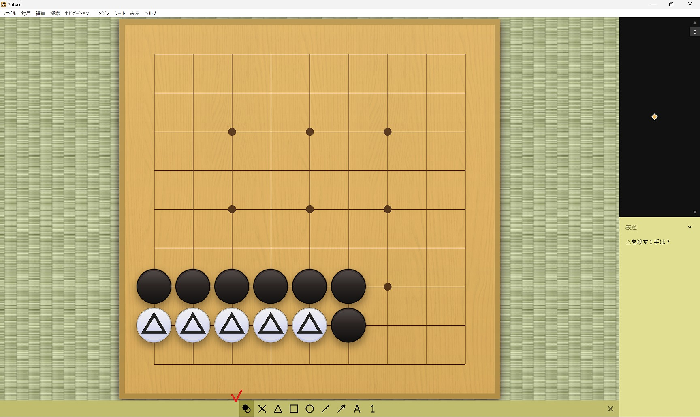

（注）この詰碁は答えが複数あるため失題ですが、使い方の説明のために使っています。

下側のツールバーで配置するものを選びながら盤上に石やマークを配置します。

使えるマークは

- ○
- ×
- △
- □
- 文字（1やAなど）

です。

終わったら、もう一度 `メニュー ＞ 編集 ＞ 編集モードを切替` を選択し、編集モードを解除します。

### 正解の入力

この状態で盤面をクリックすると黒石、白石を交互に置ける状態になっているため、まずは1手目を入力します。

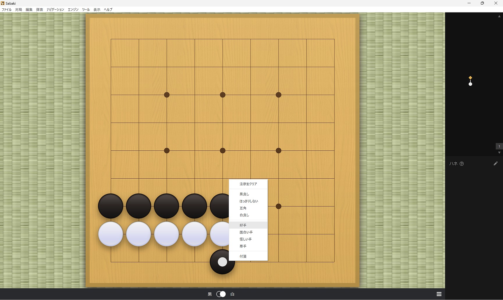

そして、1手目の石の上で右クリックし、「好手」をクリックします。

これで、正解の登録は完了です。

手筋問題など、正解が複数ある場合では、同様の手順で複数の正解を登録することができます。

### 不正解の入力

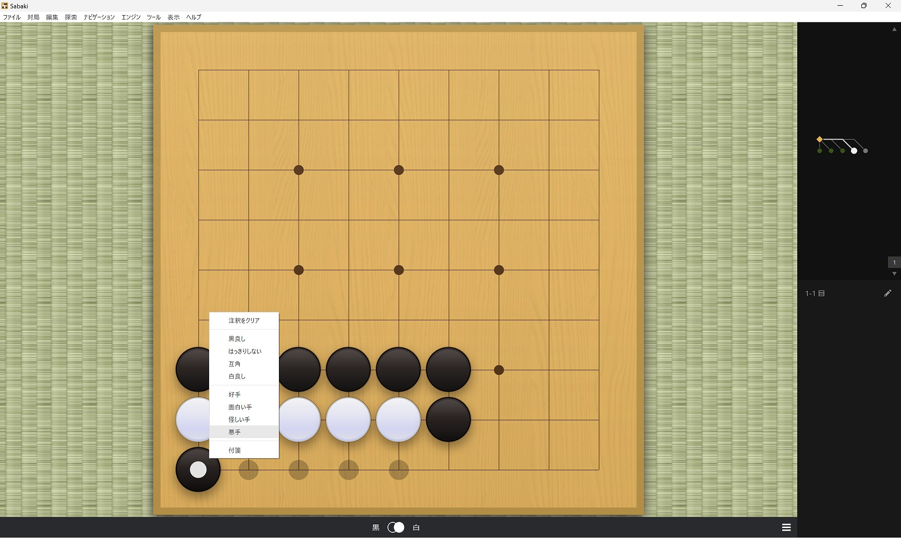

不正解を登録する場合は、「悪手」を選択します。

不正解が複数ある場合では、同様の手順で複数の不正解を登録することができます。

### 好手、悪手を指定しないときのルール

sinogiは、「好手」や「悪手」の他に、「好手」も「悪手」も指定されていない手が存在する場合、次のルールで正解か不正解として取り扱います。

| 好手    | 悪手    | 未指定の手の取り扱いルール     |
|-------|-------|-------------------|
| 存在しない | 存在しない | すべて正解として扱う        |
| 存在する  | 存在しない | 不正解として扱う          |
| 存在しない | 存在する  | 正解として扱う           |
| 存在する  | 存在する  | そもそも問題不備として取り扱わない |

### 正解の続きを入力する

1手詰めではない問題は、続きの手を入力することで作成できます。

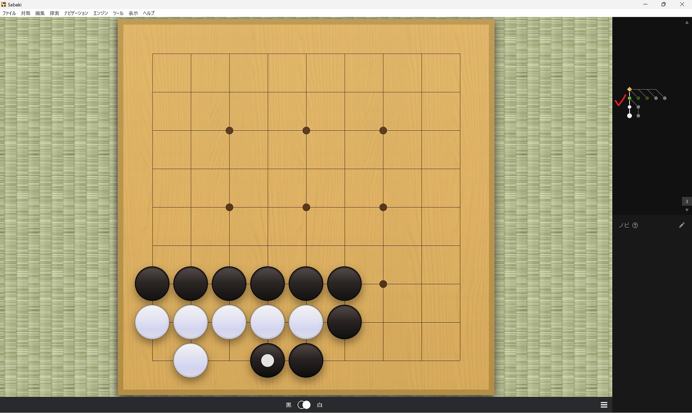

右側にあるツリーの●を押すことで手順を戻すことができます。相手の応手が複数ある場合でも、手順を戻して、そこから新しい応手を入力することで登録することができます。

sinogiでは、相手の応手が複数存在する場合には、ランダムで1つ選択して応手します。

### 複数の問題の登録

1つのSGFファイルに、複数の詰碁・手筋問題を登録することができます。

`メニュー ＞ ファイル ＞棋譜を管理` を選択し、棋譜管理モードにします。

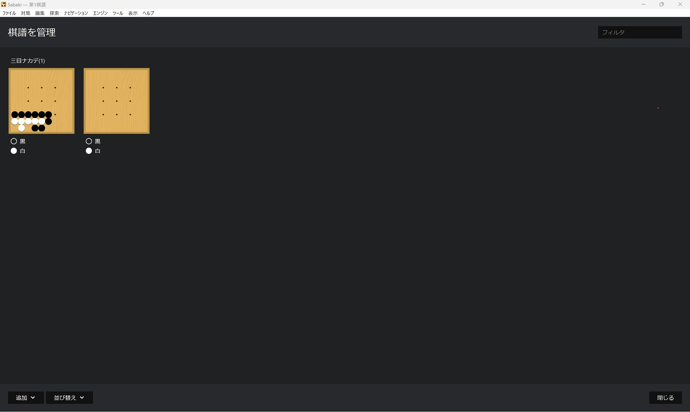

sinogiでは**SGFファイル単位で出題範囲を管理する**ため、関連性のある問題を1つのファイルにまとめておくことが重要です。

問題ができたら、`ファイル ＞ 保存` から保存します。

## 問題のインポート

sinogiを起動したら、`メニュー ＞ 問題を管理する` を選択し、問題管理画面を開きます。

右下の[+]を押して、ファイル選択ダイアログで先程保存したファイルを選択します。

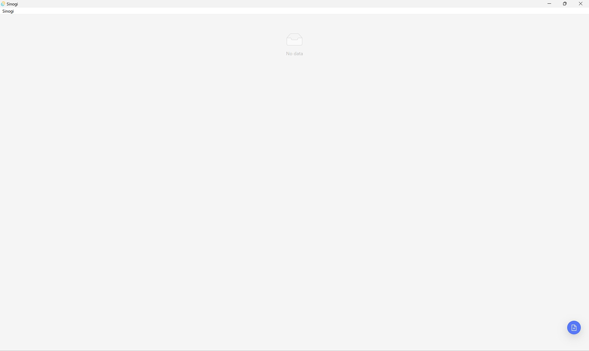

インポートが完了すると、取り込んだ問題が表示されます。

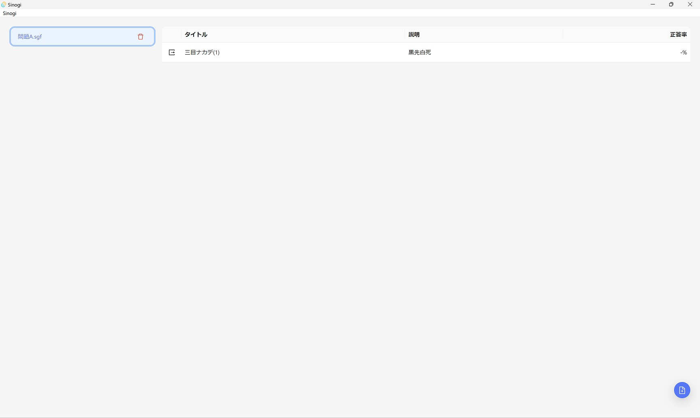

## 問題を解く

`メニュー ＞ 詰碁を解く` を選択し、詰碁回答画面を開きます。

スタートを押すと開始できます。

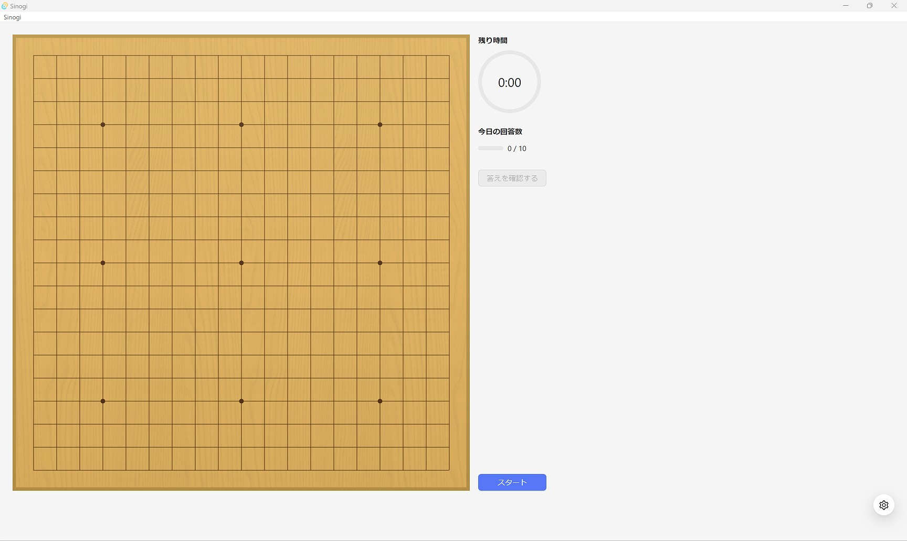

右下のボタンを押して、詰碁回答の設定ができます。

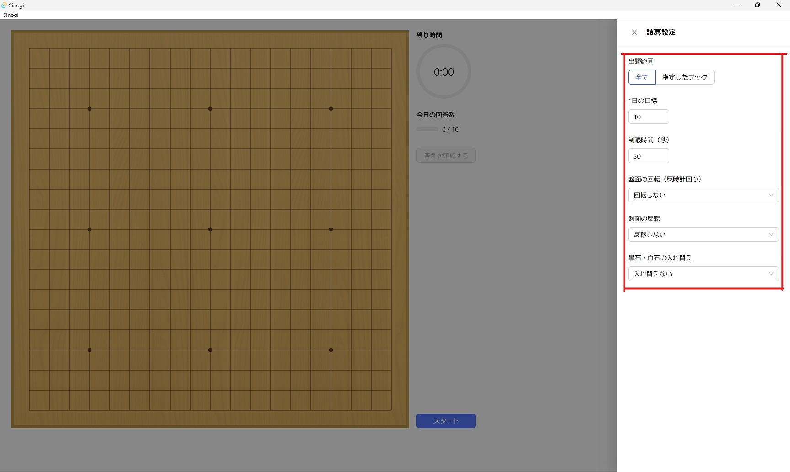

設定項目は下記のとおりです。

- 出題範囲
    - 出題範囲を全てのブックにするか、指定したブック（SGFファイルで取り込んだ問題群をブックと呼んでいます）だけにするかを選べます
- ブック一覧
    - 出題範囲を指定したブックにした場合のみ、出題するブックを複数選択できます
- 1日の目標
    - 1日に解く問題の数を設定できます
        - 0にすると設定しません
- 制限時間（秒）
    - 回答時間に制限時間を設定できます
        - 0にすると設定しません
- 盤面の回転（反時計回り）
    - 盤面を90°間隔で回転させることができます
    - 「ランダムに回転する」を選択すると、出題ごとに回転有無と回転量を決定します
- 盤面の反転
    - 盤面を上下または左右に反転させることができます
    - 「ランダムに反転する」を選択すると、出題ごとに反転有無と反転方向を決定します
- 黒石・白石の入れ替え
    - 黒石と白石を入れ替えることが出来ます
    - 「ランダムに入れ替える」を選択すると、出題ごとに入れ替えるかどうかを決定します
    - コメントに入力された「黒石」「白石」等の文言は変更されません

## 回答履歴を見る

`メニュー ＞ あしあとを見る` を選択し、あしあと画面を開きます。

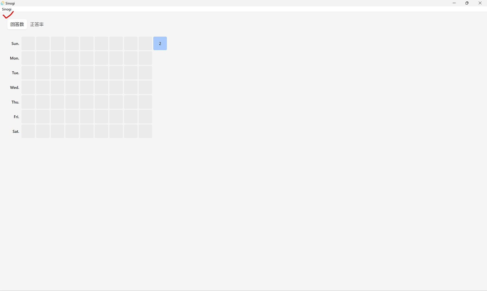

あしあと画面では、ここ最近の日ごとの回答数と正答率を確認することができます。
